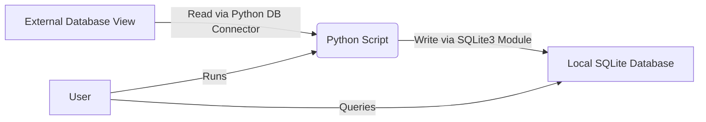

# System Patterns: Database Synchronization Utility

## 1. System Architecture Overview

The system will be a single Python script that performs an Extract, Load (EL) process. It does not involve complex transformations (ETL), as the primary goal is to replicate a view's data locally.

## 2. Key Technical Decisions

-   **Language:** Python 3.x, due to its strong database connectivity libraries, ease of scripting, and user familiarity.
-   **Local Database:** SQLite, as requested, for its serverless nature, file-based storage, and good Python integration (`sqlite3` module).
-   **External Database Connectivity:** A generic database connection approach will be aimed for, likely using a library like `SQLAlchemy` for broader compatibility or specific connectors (e.g., `psycopg2` for PostgreSQL, `mysql-connector-python` for MySQL, `pyodbc` for SQL Server) if the user specifies a particular database type. Initially, we might start with a placeholder or ask the user for the database type.
-   **Configuration Management:** Connection parameters and other settings (view name, SQLite file path) will be stored in a separate configuration file (e.g., `config.ini` or `config.json`) or managed via environment variables for security and flexibility.
-   **Data Handling:** Pandas DataFrames will likely be used internally for handling data between extraction and loading, as they provide efficient ways to read from SQL and write to SQL, and can infer schema.

## 3. Design Patterns

-   **Configuration-Driven:** The script's behavior (source/target details) will be driven by external configuration rather than hardcoded values.
-   **Modular Design:**
    -   Separate functions/modules for database connection, data extraction, and data loading.
    -   A main orchestrator function to manage the workflow.
-   **Error Handling:** Try-except blocks for database operations, file I/O, and other potentially failing operations. Logging of errors to console and/or a log file.
-   **Idempotency (for local DB update):** The synchronization process should ideally be idempotent. If run multiple times with the same source data, the local database state should be the same. The "truncate-and-load" strategy naturally supports this.

## 4. Data Synchronization Strategy

-   **Initial Strategy: Truncate-and-Load:**
    -   The simplest and most robust method for ensuring the local table is an exact replica of the source view at the time of sync.
    -   **Process:**
        1.  Fetch all data from the source view.
        2.  If the local table exists, drop it or delete all its records.
        3.  Recreate the local table based on the schema of the fetched data.
        4.  Insert all fetched data into the local table.
-   **Alternative (Future Consideration): Upsert (Update or Insert):**
    -   Requires a primary key or unique identifier to match records between source and target.
    -   More complex but can be more efficient if the data volume is very large and changes are minimal.
    -   For now, truncate-and-load is preferred for simplicity and to meet the "snapshot" requirement.

## 5. Logging and Feedback

-   Use Python's `logging` module.
-   Log key steps: script start/end, connection attempts, data extraction (e.g., number of rows fetched), data loading (e.g., number of rows written), errors.
-   Provide clear messages to the console for the user.
